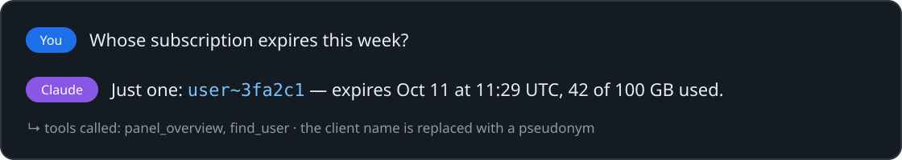
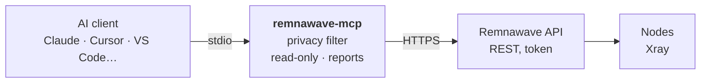

<p align="center">
  
</p>

<p align="center">
  <a href="https://github.com/3APA3A-3AHO3A/remnawave-mcp/releases/latest"></a>
  <a href="https://github.com/3APA3A-3AHO3A/remnawave-mcp/actions/workflows/ci.yml"></a>
  <a href="https://github.com/remnawave"></a>
  <a href="https://modelcontextprotocol.io"></a>
  <a href="https://github.com/3APA3A-3AHO3A/remnawave-mcp/actions/workflows/ci.yml"></a>
  <a href="https://github.com/3APA3A-3AHO3A/remnawave-mcp/pkgs/container/remnawave-mcp"></a>
  <a href="LICENSE"></a>
</p>

<p align="center">
  <a href="https://github.com/3APA3A-3AHO3A/remnawave-mcp/releases/latest">⬇️ Download</a> &nbsp;·&nbsp; <a href="#documentation">📘 Docs</a> &nbsp;·&nbsp; <a href="#connecting-a-client">🧩 Clients</a> &nbsp;·&nbsp; <a href="#option-2--docker">🐳 Docker</a> &nbsp;·&nbsp; <a href="README.md">🇷🇺 Русский</a>
</p>

MCP server for the [Remnawave](https://github.com/remnawave) **3.x** panel. It gives AI assistants — Claude, Cursor, VS Code (Copilot), Windsurf, Codex, Gemini CLI and any other MCP client — access to users, nodes, traffic, devices, connections and GeoCheck. **Read-only**, with a **privacy filter** on your side.

> [!TIP]
> **Quick start.** In Claude Desktop — download `remnawave-3.4.mcpb` from the [latest release](https://github.com/3APA3A-3AHO3A/remnawave-mcp/releases/latest) and open it, that’s all. In any other client — build the server with three commands or pull the Docker image, then paste the ready settings block from “Connecting a client” below.

> [!IMPORTANT]
> **Privacy.** Panel responses are filtered on your machine before they reach the chat: keys and passwords are hidden, clients are replaced with pseudonyms like `user~3fa2c1`.

## What it looks like

<p align="center">
  
</p>

## Features

- **Read-only by default.** Nothing in the panel changes unless you explicitly enable write tools.
- **Always matches your panel version.** Tools are not hand-written: they are generated at startup from the official [`@remnawave/backend-contract`](https://www.npmjs.com/package/@remnawave/backend-contract) package. Panel updated → bump the package → rebuild.
- **Secrets are never exposed:** panel login, passkeys, node SECRET_KEY, API tokens.
- **A leaked chat leaks neither keys nor clients.** Reality private keys, passwords, UUIDs and connection links are hidden; client personal data (username, email, Telegram ID, IP, HWID) is replaced with pseudonyms. See [Privacy](#privacy).
- **Ready-made reports in one call:** `panel_overview` (panel summary), `user_report` (everything about a client), `sharing_suspects` (who shares a subscription), plus `find_user`, `geocheck_node`, `node_connections`, `user_connections`.
- **Prompt templates** in clients that support MCP prompts: "Panel summary", "Client review", "Sharing audit", "Node check".
- **Gentle on nodes and limits:** a repeated GeoCheck of the same node within 30 minutes returns the previous result; responses are compacted (2–3× fewer tokens), the node list is short by default (`full: true` for the raw one).
- **Three ways to install:** build from source (Node.js) or a Docker image per panel version — for any client; for Claude Desktop also a one-click extension with the token kept in the system keychain.

## Compatibility

| Panel version | Status |
|---|---|
| **3.4.x** | ✅ tested on production panels (3.4.5) |
| **3.0 – 3.3** | ✅ a separate extension file per version; for a manual install — `npm i @remnawave/backend-contract@<version> --save-exact`. Tools your version doesn't have yet (e.g. GeoCheck, added in 3.4) are simply not shown |
| **2.8.x** | ⚠️ not officially supported: core tools build, but not tested against a live panel; some extra tools are unavailable |
| **2.7 and older** | ❌ use [TrackLine/mcp-remnawave](https://github.com/TrackLine/mcp-remnawave) |

The contract version should match your panel version at least in the first two numbers. The server adapts to the installed contract (routes, parameters and the tool list come from it) and checks the panel version on connect: if it differs, you get a warning in the chat telling you which build to use (extension file or contract version).

## How it fits together



## Documentation

<details>
<summary><b>📦 Installation — from source, Docker</b></summary>

### Installation

Install the server once on the computer (or server) where your AI client runs, then point the client to it — see [Connecting a client](#connecting-a-client).

> Using **Claude Desktop**? You can skip this — it has a one-click extension, see “Claude Desktop” in [Connecting a client](#connecting-a-client).

#### Option 1 — from source (Node.js)

Requires [Node.js](https://nodejs.org) 22+ and Git. Windows:

```powershell
winget install OpenJS.NodeJS.LTS
winget install Git.Git
```

Restart PowerShell, then build the server:

```powershell
cd C:\Tools
git clone https://github.com/3APA3A-3AHO3A/remnawave-mcp.git
cd remnawave-mcp
npm ci
npm run build
npm run list-tools
```

The last line should look like `79 API tools + 7 extra (contract 3.4.5)`. The server is the file `C:\Tools\remnawave-mcp\dist\index.js` — you will need its path in the client settings.

macOS / Linux: same commands, any path (e.g. `~/remnawave-mcp`).

Panel is not 3.4.x? Install the contract for your version and rebuild:

```powershell
npm i @remnawave/backend-contract@<panel_version> --save-exact
npm run build
```

#### Option 2 — Docker

No Node.js needed — just Docker. Most convenient on the panel server: Docker is already there (Remnawave itself runs in Docker).

```bash
docker pull ghcr.io/3apa3a-3aho3a/remnawave-mcp:3.4
```

- `:3.4` — image for panel 3.4.x; there are also `:3.3`, `:3.2`, `:3.1`, `:3.0` and `:latest` (current stable). amd64 and arm64, runs as non-root.
- In the client settings use `docker run` instead of `node` and a file path — ready blocks are in [Connecting a client](#connecting-a-client).
- `-e REMNAWAVE_API_TOKEN` without a value passes the token from the environment, so it doesn't show up in the process list (`ps`).

**Straight to the panel container**, bypassing nginx / Cloudflare and the internet — attach the MCP container to the panel's Docker network:

```bash
docker network ls                      # the default install uses remnawave-network
docker ps --format '{{.Names}}'        # the panel container is usually remnawave
```

and use the URL `http://remnawave:3000` and `docker run -i --rm --network remnawave-network …` in the client settings. With an `http://…` URL the server adds the headers a reverse proxy normally sets (`X-Forwarded-Proto`, `X-Forwarded-For`). If the panel still returns an error, use the external `https://` URL.

> ⚠ **Security on a server.** The MCP gives the AI convenient tools and hides secrets, but it does **not** sandbox console agents (Claude Code, Codex, Gemini CLI, etc.): with shell access to the server an agent can run any command. Run such agents on a production server **as non-root**, don't enable “allow everything”, and give the panel token `read` scopes only.

</details>

<details>
<summary><b>🔑 API token</b></summary>

### API token

**Panel → Settings → API tokens → Create.** Grant `read` only:

users, nodes, hosts, hwid, connections, bandwidth-stats, system, subscriptions, subscription-request-history, internal-squads, external-squads, config-profiles, node-plugins (other sections on `read` are optional).

Do not grant `write`, `*`, api-tokens, passkeys, auth or keygen.

> Remnawave scopes are "read/write", not GET/POST. GeoCheck, connection requests and user lookup work with `read` even though they are POST requests.

</details>

<details>
<summary><b>🧩 Connecting a client — Claude, Cursor, VS Code, Windsurf, Cline, Zed, LM Studio, Codex, Gemini CLI</b></summary>

### Connecting a client

Every client needs the same thing: the command that starts the server and two variables — `REMNAWAVE_BASE_URL` (panel URL) and `REMNAWAVE_API_TOKEN` ([token](#api-token)). Only the place to put them differs.

The examples use a server built from source in `C:\Tools\remnawave-mcp` (backslashes are doubled in JSON: `\\`). On macOS / Linux use your path, e.g. `/home/user/remnawave-mcp/dist/index.js`.

**Via Docker** — in any example replace `command` and `args`:

```json
"command": "docker",
"args": ["run", "-i", "--rm", "-e", "REMNAWAVE_BASE_URL", "-e", "REMNAWAVE_API_TOKEN", "ghcr.io/3apa3a-3aho3a/remnawave-mcp:3.4"],
```

**Several panels** — add several blocks with different names (`remnawave-main`, `remnawave-2`, …), each with its own URL and token.

Open your client:

<details>
<summary><b>Claude Desktop</b></summary>

**One-click extension** (easiest, no Node.js needed — Claude Desktop ships its own):

1. Check your panel version — it is shown at the bottom of the Remnawave panel (e.g. `3.4.5`). Open the [latest release](https://github.com/3APA3A-3AHO3A/remnawave-mcp/releases/latest) and download the matching file:

| Panel | File |
|---|---|
| 3.4.x | `remnawave-3.4.mcpb` |
| 3.3.x | `remnawave-3.3.mcpb` |
| 3.2.x | `remnawave-3.2.mcpb` |
| 3.1.x | `remnawave-3.1.mcpb` |
| 3.0.x | `remnawave-3.0.mcpb` |

   Picked the wrong one? The server compares versions and tells you in the chat which file you need.
2. Double-click the file (or drag it into **Claude → Settings → Extensions**).
3. Click **Install** and fill in the **panel URL** and **API token**. Other fields can stay empty.
4. Done — ask in the chat: "Give me a panel summary".

The token is stored in the Windows/macOS keychain, not as plain text. To update, download the new `.mcpb` and open it the same way. An extension connects **one** panel; for several, set it up manually as below.

**Manually** (server [from source](#option-1--from-source-nodejs) or Docker): **Claude → Settings → Developer → Edit Config**. Fully quit Claude (tray → Quit), then add this right after the first `{` in `claude_desktop_config.json`:

```json
  "mcpServers": {
    "remnawave": {
      "command": "node",
      "args": ["C:\\Tools\\remnawave-mcp\\dist\\index.js"],
      "env": {
        "REMNAWAVE_BASE_URL": "https://panel.example.com",
        "REMNAWAVE_API_TOKEN": "YOUR_TOKEN"
      }
    }
  },
```

Keep the trailing comma if the file has other settings. Start Claude — in **Settings → Developer** the server should be **running**. Full example: [`examples/claude_desktop_config.example.json`](examples/claude_desktop_config.example.json).

</details>

<details>
<summary><b>Claude Code</b></summary>

One command:

```bash
claude mcp add remnawave --scope user -e REMNAWAVE_BASE_URL=https://panel.example.com -e REMNAWAVE_API_TOKEN=YOUR_TOKEN -- node /path/to/remnawave-mcp/dist/index.js
```

Via Docker (e.g. Claude Code right on the panel server):

```bash
claude mcp add remnawave --scope user \
  -e REMNAWAVE_BASE_URL=https://panel.example.com \
  -e REMNAWAVE_API_TOKEN=YOUR_TOKEN \
  -- docker run -i --rm -e REMNAWAVE_BASE_URL -e REMNAWAVE_API_TOKEN ghcr.io/3apa3a-3aho3a/remnawave-mcp:3.4
```

- `--scope user` — available in every project.
- `--scope local` — only in the current project. Handy for **different panels in different projects**: run `claude mcp add` in each project with its own URL and token. The settings live in your personal Claude Code config, not in the repository.
- Avoid `--scope project`: it writes the server with its token into `.mcp.json`, which usually ends up in git.
- Check: `claude mcp list` — the server should be `✓ Connected`.

</details>

<details>
<summary><b>Cursor</b></summary>

`~/.cursor/mcp.json` — for all projects, or `.cursor/mcp.json` in a project. The server shows up in **Settings → MCP**.

```json
{
  "mcpServers": {
    "remnawave": {
      "command": "node",
      "args": ["C:\\Tools\\remnawave-mcp\\dist\\index.js"],
      "env": {
        "REMNAWAVE_BASE_URL": "https://panel.example.com",
        "REMNAWAVE_API_TOKEN": "YOUR_TOKEN"
      }
    }
  }
}
```

</details>

<details>
<summary><b>VS Code (GitHub Copilot)</b></summary>

`.vscode/mcp.json` in a project, or the **MCP: Open User Configuration** command for all projects. The key here is `servers`; VS Code asks for the token on first start and keeps it in secure storage — it never lands in the file.

```json
{
  "inputs": [
    { "type": "promptString", "id": "remnawave-token", "description": "Remnawave API token", "password": true }
  ],
  "servers": {
    "remnawave": {
      "command": "node",
      "args": ["C:\\Tools\\remnawave-mcp\\dist\\index.js"],
      "env": {
        "REMNAWAVE_BASE_URL": "https://panel.example.com",
        "REMNAWAVE_API_TOKEN": "${input:remnawave-token}"
      },
      "type": "stdio"
    }
  }
}
```

Prompt templates in Copilot chat — via “/”.

</details>

<details>
<summary><b>Windsurf</b></summary>

**Settings → Cascade → MCP Servers → View raw config** opens `mcp_config.json`.

```json
{
  "mcpServers": {
    "remnawave": {
      "command": "node",
      "args": ["C:\\Tools\\remnawave-mcp\\dist\\index.js"],
      "env": {
        "REMNAWAVE_BASE_URL": "https://panel.example.com",
        "REMNAWAVE_API_TOKEN": "YOUR_TOKEN"
      }
    }
  }
}
```

</details>

<details>
<summary><b>Cline</b></summary>

The **MCP Servers** icon in the Cline panel → **Configure** → **Configure MCP Servers** opens `cline_mcp_settings.json`.

```json
{
  "mcpServers": {
    "remnawave": {
      "command": "node",
      "args": ["C:\\Tools\\remnawave-mcp\\dist\\index.js"],
      "env": {
        "REMNAWAVE_BASE_URL": "https://panel.example.com",
        "REMNAWAVE_API_TOKEN": "YOUR_TOKEN"
      }
    }
  }
}
```

</details>

<details>
<summary><b>Zed</b></summary>

The **zed: open settings file** command (or **Settings → AI → MCP Servers**). The key here is `context_servers`.

```json
{
  "context_servers": {
    "remnawave": {
      "command": "node",
      "args": ["C:\\Tools\\remnawave-mcp\\dist\\index.js"],
      "env": {
        "REMNAWAVE_BASE_URL": "https://panel.example.com",
        "REMNAWAVE_API_TOKEN": "YOUR_TOKEN"
      }
    }
  }
}
```

</details>

<details>
<summary><b>LM Studio</b></summary>

**Program** tab on the right → **Install → Edit mcp.json**.

```json
{
  "mcpServers": {
    "remnawave": {
      "command": "node",
      "args": ["C:\\Tools\\remnawave-mcp\\dist\\index.js"],
      "env": {
        "REMNAWAVE_BASE_URL": "https://panel.example.com",
        "REMNAWAVE_API_TOKEN": "YOUR_TOKEN"
      }
    }
  }
}
```

</details>

<details>
<summary><b>Codex CLI</b></summary>

`~/.codex/config.toml` (TOML):

```toml
[mcp_servers.remnawave]
command = "node"
args = ['C:\Tools\remnawave-mcp\dist\index.js']

[mcp_servers.remnawave.env]
REMNAWAVE_BASE_URL = "https://panel.example.com"
REMNAWAVE_API_TOKEN = "YOUR_TOKEN"
```

</details>

<details>
<summary><b>Gemini CLI</b></summary>

`~/.gemini/settings.json` — for all projects, or `.gemini/settings.json` in a project.

```json
{
  "mcpServers": {
    "remnawave": {
      "command": "node",
      "args": ["C:\\Tools\\remnawave-mcp\\dist\\index.js"],
      "env": {
        "REMNAWAVE_BASE_URL": "https://panel.example.com",
        "REMNAWAVE_API_TOKEN": "YOUR_TOKEN"
      }
    }
  }
}
```

</details>

> ℹ️ **Not supported:** clients that only connect to remote MCP servers by URL (HTTP) — e.g. ChatGPT and web versions of assistants. remnawave-mcp runs on your computer or server and talks to the client directly (stdio).
>
> Your client is not listed? Any client that can launch local MCP servers works: command `node`, the path to `dist/index.js` and two variables — `REMNAWAVE_BASE_URL` and `REMNAWAVE_API_TOKEN`.

</details>

<details>
<summary><b>⚙️ Configuration (environment variables)</b></summary>

### Configuration (environment variables)

| Variable | Required | Description |
|---|---|---|
| `REMNAWAVE_BASE_URL` | yes | Panel URL: `https://panel.example.com` (no `/api`) |
| `REMNAWAVE_API_TOKEN` | yes | API token |
| `REMNAWAVE_READONLY` | no | `true` by default. `false` enables write tools (the token needs `write` too) |
| `REMNAWAVE_PRIVACY` | no | `strict` by default, `basic` or `off` — see [Privacy](#privacy) |
| `REMNAWAVE_PRIVACY_SALT` | no | Any long string — keeps pseudonyms stable across restarts |
| `REMNAWAVE_API_KEY` | no | `X-Api-Key` header — panel behind Caddy with a secret path |
| `REMNAWAVE_HEADERS` | no | Extra headers for every request, JSON: `{"X-Name": "value"}` |
| `CF_ACCESS_CLIENT_ID`, `CF_ACCESS_CLIENT_SECRET` | no | Panel behind Cloudflare Access |
| `REMNAWAVE_TOOLS_EXCLUDE` | no | Hide tools (comma-separated) |
| `REMNAWAVE_TOOLS_INCLUDE` | no | Expose only these tools |
| `REMNAWAVE_MAX_RESPONSE_CHARS` | no | Max response length, default 60000. Long lists are shortened with a "shown N of M" note |
| `REMNAWAVE_COMPACT` | no | `true` by default — compact responses without empty fields and duplicates. `false` — as returned by the panel |
| `REMNAWAVE_MAX_PAGE_SIZE` | no | Cap for list page size per request, default 200 (0 — no cap) |
| `REMNAWAVE_GEOCHECK_COOLDOWN_MIN` | no | At most one GeoCheck per node every N minutes, default 30 (0 — no limit) |
| `REMNAWAVE_CONNECTIONS_COOLDOWN_MIN` | no | Same for connection lists, default 2 |
| `REMNAWAVE_TIMEOUT_MS` | no | Request timeout, default 30000 |

</details>

<details>
<summary><b>💬 What to ask</b></summary>

### What to ask

Ready templates are available in clients that support MCP prompts: **Panel summary**, **Client review**, **Sharing audit**, **Node check**. Elsewhere just type.

Or just ask:

- "How is the panel doing?" — online users, offline nodes, traffic, expiring subscriptions
- "Review client 1234" — subscription, devices, traffic per day and node, recent requests
- "Who seems to share their subscription?"
- "How many active and online users?"
- "Find the client with Telegram ID 123456789, show devices and expiry date"
- "Which nodes are offline?" / "Traffic per node for last week"
- "Run GeoCheck on node NL-1"
- "Who is on node DE-1 right now and from how many IPs?"
- "Top users by device count" / "Torrent report for the last day"

GeoCheck and connection lists run on the node and cost its traffic, so a repeated request for the same node within 30 minutes (connections: 2 minutes) returns the previous result with a note instead of loading the node again.

</details>

<details>
<summary><b>🛡 Privacy — what is hidden in each mode</b></summary>

### Privacy

Everything the server returns ends up in the chat history, so panel responses are filtered **on your machine**, before they reach the model.

| Data | `strict` (default) | `basic` | `off` |
|---|---|---|---|
| Reality private keys & shortId(s), UUIDs and `auth` of cascade outbounds in snippets, SECRET_KEY, passwords, API keys, error texts | hidden | hidden | visible |
| VLESS UUID, `vless://`, `ss://`… links, subscription shortUuid & URL | hidden | hidden | visible |
| "Connection keys" and "raw subscription" tools | unavailable | unavailable | available |
| username, email, Telegram ID, client notes | pseudonym | visible | visible |
| client IP addresses, HWID (incl. device IDs in User-Agent), client computer names (`DESKTOP-…`) | pseudonym | visible | visible |
| panel user ID, status, traffic, dates, nodes, statistics | visible | visible | visible |

**Pseudonyms.** Instead of `ivan_petrov` the model sees `user~dca596`, instead of an IP — `ip~f055f3`. Equal values get equal pseudonyms, so the model can still notice "two clients share an IP" without learning it. A pseudonym can be passed back as a tool argument — the server resolves it locally.

Need the real data? Open the client in the panel by their ID.

**Limits:** whatever you type into the chat yourself (e.g. "find Telegram ID 123…") stays in the chat. Prefer panel user IDs or pseudonyms.

Also:
- With the extension the token is kept in the system keychain; with a manual install — only in your MCP client config, never in the repository.
- Every change is checked by automated tests: if anything starts letting keys or client data through, CI turns red.
- Use a dedicated read-only token so it can be revoked without touching bots or monitoring.

</details>

<details>
<summary><b>🩺 Troubleshooting · Updating</b></summary>

### Troubleshooting

**First check the server without a client** — in the server folder:

```powershell
$env:REMNAWAVE_BASE_URL="https://panel.example.com"; $env:REMNAWAVE_API_TOKEN="YOUR_TOKEN"; node dist/index.js
```

A line like `remnawave-mcp 1.3.1: 86 tools, read-only, privacy strict, https://panel.example.com` means the server starts (it then waits for a client — stop it with `Ctrl+C`). An error instead — look it up in the table.

| Symptom | Fix |
|---|---|
| The client shows the server with an error / red status | Check the settings block: commas, braces, `\\` in Windows paths; the path to `dist/index.js` exists (`npm run build`) |
| `Remnawave API 401` | Token expired or deleted — create a new one |
| `Remnawave API 403` | Token lacks `read` on a section — recreate it with the right scopes |
| `fetch failed` / `ENOTFOUND` / timeout | Panel unreachable or wrong `REMNAWAVE_BASE_URL` |
| Tools don't show up | Fully restart the client (Claude Desktop — tray → Quit) |

**Server logs** are shown by the client itself — usually in its MCP settings or output panel. Claude Desktop writes them to files: Windows `%APPDATA%\Claude\logs\mcp-server-<name>.log`, macOS `~/Library/Logs/Claude/`.

### Updating

- **Claude Desktop extension** — download the new `.mcpb` from the [latest release](https://github.com/3APA3A-3AHO3A/remnawave-mcp/releases/latest) and open it.
- **Docker** — `docker pull ghcr.io/3apa3a-3aho3a/remnawave-mcp:3.4`.
- **From source:**

```powershell
cd C:\Tools\remnawave-mcp
git pull
npm ci
npm run build
```

Restart the client after updating.

Once a day GitHub Actions compares the latest **stable** Remnawave panel release with the contract version in the project and, if a new one is out, opens a Pull Request with the updated and built project and runs the regular CI checks on it. Intermediate contract builds between releases are skipped.

</details>

<details>
<summary><b>🧪 How it works and for developers</b></summary>

### How it works

In `@remnawave/backend-contract` every API endpoint is described as a "command": URL, method, zod schemas and a read/write mark. At startup the server walks through all commands and turns each into an MCP tool, validating arguments with the same schemas the panel uses. That is why the code barely depends on the Remnawave version.

```
src/
  index.ts     — MCP server, tool selection, calls
  registry.ts  — tools generated from the contract, block lists
  server.ts    — MCP server: tool list, calls, prompts
  extras.ts    — reports and convenience tools (panel_overview, user_report, …)
  prompts.ts   — prompt templates (MCP prompts)
  redact.ts    — privacy filter: secrets and pseudonyms
  format.ts    — compact output and shortening of long lists
  limits.ts    — GeoCheck repeat limits and list size cap
  version.ts   — panel version vs. build version check
  client.ts    — HTTP requests to the panel
  config.ts    — environment variables
```

### For developers

```bash
npm test                    # 42 tests: privacy (nothing leaks), reports, limits, tool list
npm run pack:mcpb           # extension for the current version → build/remnawave-3.4.mcpb
npm run pack:mcpb -- --all  # for every 3.x version → build/remnawave-3.0.mcpb … remnawave-3.4.mcpb
```

- **CI** on every push: build, tests, `npm audit`, extension build (downloadable from Actions → run → Artifacts).
- **Release:** bump the version in `package.json`, add a `CHANGELOG.md` section, then either **Releases → Draft a new release** on GitHub (tag `vX.Y.Z`) or `git tag vX.Y.Z` + `git push origin vX.Y.Z`. GitHub builds, runs the tests and attaches `.mcpb` files for every 3.x version; an empty release text is filled from CHANGELOG.
- **Before a release** update the static badges at the top of both READMEs (supported Remnawave versions, number of tests) and, if the wording changes, the banner and the chat example in `docs/` (plain SVG, the text is edited like any file).
- **New panel version:** a daily workflow checks the latest stable Remnawave release and opens a PR with the updated contract.

</details>

## Credits

Inspired by [TrackLine/mcp-remnawave](https://github.com/TrackLine/mcp-remnawave) (Remnawave 2.x).

## License

[MIT](LICENSE)
