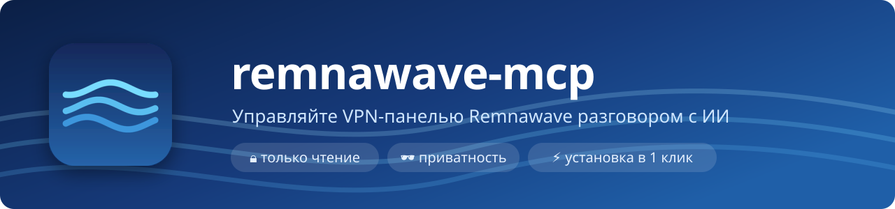
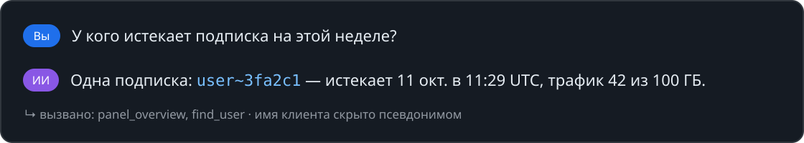
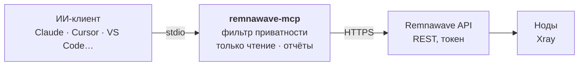

<p align="center">
  
</p>

<p align="center">
  <a href="https://github.com/3APA3A-3AHO3A/remnawave-mcp/releases/latest"></a>
  <a href="https://github.com/3APA3A-3AHO3A/remnawave-mcp/actions/workflows/ci.yml"></a>
  <a href="https://github.com/remnawave"></a>
  <a href="https://modelcontextprotocol.io"></a>
  <a href="https://github.com/3APA3A-3AHO3A/remnawave-mcp/actions/workflows/ci.yml"></a>
  <a href="https://github.com/3APA3A-3AHO3A/remnawave-mcp/pkgs/container/remnawave-mcp"></a>
  <a href="LICENSE"></a>
</p>

<p align="center">
  <a href="https://github.com/3APA3A-3AHO3A/remnawave-mcp/releases/latest">⬇️ Скачать</a> &nbsp;·&nbsp; <a href="#документация">📘 Документация</a> &nbsp;·&nbsp; <a href="#подключение-к-клиентам">🧩 Клиенты</a> &nbsp;·&nbsp; <a href="#способ-3--docker-на-сервере-с-панелью-claude-code">🐳 Docker</a> &nbsp;·&nbsp; <a href="README.en.md">🇬🇧 English</a>
</p>

MCP-сервер для панели [Remnawave](https://github.com/remnawave) **3.x**. Даёт ИИ-ассистентам — Claude, Cursor, VS Code (Copilot), Windsurf, Codex, Gemini CLI и любым другим MCP-клиентам — доступ к пользователям, нодам, трафику, устройствам, подключениям и GeoCheck. **Только чтение** и **фильтр приватности** на вашей стороне.

> [!TIP]
> **Быстрый старт в Claude Desktop.** Скачайте `remnawave-3.4.mcpb` (или файл под свою версию панели) из [последнего релиза](https://github.com/3APA3A-3AHO3A/remnawave-mcp/releases/latest) и откройте его. Другие клиенты — раздел «Подключение к клиентам» ниже.

> [!IMPORTANT]
> **Приватность.** Ответы панели фильтруются у вас на компьютере, до отправки в чат: ключи и пароли скрыты, а клиенты заменены псевдонимами вроде `user~3fa2c1`.

## Как это выглядит

<p align="center">
  
</p>

## Возможности

- **Только чтение по умолчанию.** Ничего в панели не меняется, пока вы явно не включите запись.
- **Всегда под вашу версию панели.** Инструменты не написаны руками, а собираются из официального пакета [`@remnawave/backend-contract`](https://www.npmjs.com/package/@remnawave/backend-contract). Обновили панель → подняли версию пакета → пересобрали.
- **Секреты недоступны никогда:** вход в панель, passkey, SECRET_KEY нод, API-токены.
- **Утечка чата не выдаёт ни ключей, ни клиентов.** Приватные ключи Reality, пароли, UUID и ссылки подключения скрываются, а личные данные клиентов (username, email, Telegram ID, IP, HWID) заменяются псевдонимами. Подробнее — [Приватность](#приватность).
- **Готовые отчёты одной командой:** `panel_overview` (сводка по панели), `user_report` (всё о клиенте), `sharing_suspects` (кто делится подпиской), плюс `find_user`, `geocheck_node`, `node_connections`, `user_connections`.
- **Шаблоны запросов** (в Claude — меню «+», в VS Code — команды через «/»): «Сводка по панели», «Разбор клиента», «Кто делится подпиской», «Проверка нод».
- **Бережёт ноды и лимиты:** повторный GeoCheck одной ноды в течение 30 минут отдаёт прошлый результат, ответы сжаты (в 2–3 раза меньше токенов), список нод по умолчанию короткий (`full: true` — полный).
- **Установка в один клик** — расширение `.mcpb` для Claude Desktop, токен хранится в защищённом хранилище системы. Для серверов — **Docker-образ** под каждую версию панели.

## Совместимость

| Версия панели | Статус |
|---|---|
| **3.4.x** | ✅ проверено на рабочих панелях (3.4.5) |
| **3.0 – 3.3** | ✅ отдельный файл расширения под каждую версию; при ручной установке — `npm i @remnawave/backend-contract@<версия> --save-exact`. Команды, которых в вашей версии ещё нет (например, GeoCheck появился в 3.4), просто не показываются |
| **2.8.x** | ⚠️ не поддерживается официально: основные команды собираются, но на живой панели не проверялось, часть доп. команд недоступна |
| **2.7 и старше** | ❌ используйте [TrackLine/mcp-remnawave](https://github.com/TrackLine/mcp-remnawave) |

Версия контракта должна совпадать с версией панели хотя бы по первым двум цифрам. Сервер сам подстраивается под установленный контракт (адреса, параметры и список команд берутся из него), а при подключении сверяет версию панели: если она другая, в чате появится предупреждение с подсказкой, какой файл скачать.

## Как устроено



## Документация

<details>
<summary><b>📦 Установка — расширение Claude Desktop, из исходников, Docker</b></summary>

### Установка
#### Способ 1 — расширение Claude Desktop (проще всего)

1. Узнайте версию своей панели — она написана внизу панели Remnawave (например, `3.4.5`).
   Откройте [последний релиз](https://github.com/3APA3A-3AHO3A/remnawave-mcp/releases/latest) и скачайте файл под неё:

   | Панель | Файл |
   |---|---|
   | 3.4.x | `remnawave-3.4.mcpb` |
   | 3.3.x | `remnawave-3.3.mcpb` |
   | 3.2.x | `remnawave-3.2.mcpb` |
   | 3.1.x | `remnawave-3.1.mcpb` |
   | 3.0.x | `remnawave-3.0.mcpb` |

   Взяли не тот файл — не страшно: сервер сам сравнит версии и подскажет в чате, какой файл нужен.
2. Дважды щёлкните по файлу (или **Claude → Настройки → Расширения** и перетащите файл в окно).
3. Нажмите **Установить** и заполните: **адрес панели** и **API-токен** (как создать — [ниже](#api-токен-в-панели)). Остальные поля можно оставить пустыми.
4. Готово — спросите в чате: «Сделай сводку по панели».

Нужен только Claude Desktop — Node.js у него встроенный. Токен хранится в защищённом хранилище Windows/macOS, а не текстом в файле. Обновление (новая версия remnawave-mcp или панели) — скачать нужный `.mcpb` и открыть его так же.

> Расширение подключает **одну** панель. Для нескольких панелей и для других клиентов (Cursor, VS Code, Windsurf…) — способ 2 или 3.

#### Способ 2 — из исходников (любой MCP-клиент)

Нужны [Node.js](https://nodejs.org) 22+ и Git.

```powershell
winget install OpenJS.NodeJS.LTS
winget install Git.Git
```

После установки перезапустите PowerShell.

```powershell
cd C:\Tools
git clone https://github.com/3APA3A-3AHO3A/remnawave-mcp.git
cd remnawave-mcp
npm ci
npm run build
npm run list-tools
```

Последняя строка должна быть вида `79 API tools + 7 extra (contract 3.4.5)`. Дальше — [подключение к клиенту](#подключение-к-клиентам).

На macOS / Linux — те же команды, путь любой.

#### Способ 3 — Docker на сервере с панелью (Claude Code)

Node.js не нужен — только Docker. Удобнее всего на сервере с панелью: Docker там уже есть (Remnawave сама работает в Docker). Пример ниже — для Claude Code; для других клиентов см. [подключение через Docker](#подключение-к-клиентам).

```bash
claude mcp add remnawave --scope user \
  -e REMNAWAVE_BASE_URL=https://panel.example.com \
  -e REMNAWAVE_API_TOKEN=ВАШ_ТОКЕН \
  -- docker run -i --rm -e REMNAWAVE_BASE_URL -e REMNAWAVE_API_TOKEN ghcr.io/3apa3a-3aho3a/remnawave-mcp:3.4
```

- `:3.4` — образ под панель 3.4.x; есть `:3.3`, `:3.2`, `:3.1`, `:3.0` и `:latest` (текущая стабильная). Образы для amd64 и arm64.
- `-e REMNAWAVE_API_TOKEN` у `docker run` без значения — токен передаётся в контейнер из окружения и не светится в списке процессов (`ps`).
- Обновление: `docker pull ghcr.io/3apa3a-3aho3a/remnawave-mcp:3.4`.
- Проверка: `claude mcp list` → `✓ Connected`.

**Напрямую к контейнеру панели**, минуя nginx / Cloudflare и интернет — подключите MCP к Docker-сети панели:

```bash
docker network ls                      # в стандартной установке сеть называется remnawave-network
docker ps --format '{{.Names}}'        # контейнер панели — обычно remnawave

claude mcp add remnawave --scope user \
  -e REMNAWAVE_BASE_URL=http://remnawave:3000 \
  -e REMNAWAVE_API_TOKEN=ВАШ_ТОКЕН \
  -- docker run -i --rm --network remnawave-network -e REMNAWAVE_BASE_URL -e REMNAWAVE_API_TOKEN ghcr.io/3apa3a-3aho3a/remnawave-mcp:3.4
```

При адресе `http://…` сервер сам добавляет заголовки, которые обычно ставит обратный прокси (`X-Forwarded-Proto`, `X-Forwarded-For`). Если панель всё равно отвечает ошибкой — используйте внешний `https://` адрес из первого примера.

> ⚠ **Безопасность.** MCP даёт Claude удобные команды и прячет секреты, но **не ограничивает** Claude Code: если у него есть доступ к консоли сервера, он может выполнить любую команду. Запускайте Claude Code на боевом сервере **не от root**, не включайте режим «разрешать всё», а токен панели давайте только с правами `read`.

</details>

<details>
<summary><b>🔑 API-токен в панели</b></summary>

### API-токен в панели

**Настройки → API-токены → Создать.** Выдайте только права `read`:

users, nodes, hosts, hwid, connections, bandwidth-stats, system, subscriptions, subscription-request-history, internal-squads, external-squads, config-profiles, node-plugins (по желанию — остальные разделы тоже на `read`).

Не выдавайте `write`, `*`, а также api-tokens, passkeys, auth, keygen.

> Права в Remnawave делятся на «чтение/запись», а не на GET/POST. Поэтому GeoCheck, запросы подключений и поиск пользователя работают с правами `read`, хотя это POST-запросы.

</details>

<details>
<summary><b>🧩 Подключение к клиентам — Claude, Cursor, VS Code, Windsurf, Cline, Zed, LM Studio, Codex, Gemini CLI</b></summary>

### Подключение к клиентам

Сервер один и тот же для всех клиентов — отличается только, куда вписать настройки. В примерах путь `C:\Tools\remnawave-mcp\dist\index.js` (после [сборки из исходников](#способ-2--из-исходников-любой-mcp-клиент)) — замените на свой; на macOS / Linux, например, `/home/user/remnawave-mcp/dist/index.js`. В JSON обратные слэши удваиваются: `\\`.

**Через Docker вместо Node.js** — в любом клиенте замените `command` и `args`:

```json
"command": "docker",
"args": ["run", "-i", "--rm", "-e", "REMNAWAVE_BASE_URL", "-e", "REMNAWAVE_API_TOKEN", "ghcr.io/3apa3a-3aho3a/remnawave-mcp:3.4"],
```

Раскройте свой клиент:

<details>
<summary><b>Claude Desktop</b></summary>

Проще всего — [расширение](#способ-1--расширение-claude-desktop-проще-всего). Вручную (несколько панелей):

**Claude → Настройки → Разработчик → Edit Config.** Полностью закройте Claude (трей → Выход), в открывшемся `claude_desktop_config.json` добавьте в начало, сразу после первой `{`:

```json
  "mcpServers": {
    "remnawave": {
      "command": "node",
      "args": ["C:\\Tools\\remnawave-mcp\\dist\\index.js"],
      "env": {
        "REMNAWAVE_BASE_URL": "https://panel.example.com",
        "REMNAWAVE_API_TOKEN": "ВАШ_ТОКЕН"
      }
    }
  },
```

- В пути обратные слэши двойные: `\\`.
- Запятая после блока обязательна, если в файле есть другие настройки.
- Несколько панелей — несколько блоков с разными именами (`remnawave-main`, `remnawave-2` …).

Запустите Claude. В **Настройки → Разработчик** сервер должен быть в статусе **running**. Проверка — спросите: «Сколько пользователей онлайн в панели?»

Пример целиком: [`examples/claude_desktop_config.example.json`](examples/claude_desktop_config.example.json).

</details>

<details>
<summary><b>Claude Code</b></summary>

После шагов способа 2 (клонировать и собрать) зарегистрируйте сервер одной командой:

```powershell
claude mcp add remnawave --scope user -e REMNAWAVE_BASE_URL=https://panel.example.com -e REMNAWAVE_API_TOKEN=ВАШ_ТОКЕН -- node "C:\Tools\remnawave-mcp\dist\index.js"
```

- `--scope user` — сервер доступен во всех проектах.
- `--scope local` — только в текущем проекте. Так удобно держать **разные панели в разных проектах**: в каждом проекте своя команда `claude mcp add` со своим адресом и токеном. Настройки хранятся в личном конфиге Claude Code, а не в репозитории — случайно закоммитить токен нельзя.
- Не используйте `--scope project`: он записывает сервер вместе с токеном в `.mcp.json`, который обычно попадает в git.
- Проверка: `claude mcp list` — сервер должен быть `✓ Connected`.

</details>

<details>
<summary><b>Cursor</b></summary>

Файл `~/.cursor/mcp.json` — для всех проектов, или `.cursor/mcp.json` в папке проекта. Сервер появится в **Settings → MCP**.

```json
{
  "mcpServers": {
    "remnawave": {
      "command": "node",
      "args": ["C:\\Tools\\remnawave-mcp\\dist\\index.js"],
      "env": {
        "REMNAWAVE_BASE_URL": "https://panel.example.com",
        "REMNAWAVE_API_TOKEN": "ВАШ_ТОКЕН"
      }
    }
  }
}
```

</details>

<details>
<summary><b>VS Code (GitHub Copilot)</b></summary>

Файл `.vscode/mcp.json` в проекте или команда **MCP: Open User Configuration** — для всех проектов. Ключ здесь `servers`, а токен VS Code спросит при первом запуске и сохранит в защищённом хранилище — в файл он не попадает.

```json
{
  "inputs": [
    { "type": "promptString", "id": "remnawave-token", "description": "Remnawave API token", "password": true }
  ],
  "servers": {
    "remnawave": {
      "command": "node",
      "args": ["C:\\Tools\\remnawave-mcp\\dist\\index.js"],
      "env": {
        "REMNAWAVE_BASE_URL": "https://panel.example.com",
        "REMNAWAVE_API_TOKEN": "${input:remnawave-token}"
      },
      "type": "stdio"
    }
  }
}
```

Шаблоны запросов в чате Copilot — через «/».

</details>

<details>
<summary><b>Windsurf</b></summary>

**Settings → Cascade → MCP Servers → View raw config** — откроется `mcp_config.json`.

```json
{
  "mcpServers": {
    "remnawave": {
      "command": "node",
      "args": ["C:\\Tools\\remnawave-mcp\\dist\\index.js"],
      "env": {
        "REMNAWAVE_BASE_URL": "https://panel.example.com",
        "REMNAWAVE_API_TOKEN": "ВАШ_ТОКЕН"
      }
    }
  }
}
```

</details>

<details>
<summary><b>Cline</b></summary>

Значок **MCP Servers** в панели Cline → **Configure** → **Configure MCP Servers** — откроется `cline_mcp_settings.json`.

```json
{
  "mcpServers": {
    "remnawave": {
      "command": "node",
      "args": ["C:\\Tools\\remnawave-mcp\\dist\\index.js"],
      "env": {
        "REMNAWAVE_BASE_URL": "https://panel.example.com",
        "REMNAWAVE_API_TOKEN": "ВАШ_ТОКЕН"
      }
    }
  }
}
```

</details>

<details>
<summary><b>Zed</b></summary>

Команда **zed: open settings file** (или **Settings → AI → MCP Servers**). Ключ здесь `context_servers`.

```json
{
  "context_servers": {
    "remnawave": {
      "command": "node",
      "args": ["C:\\Tools\\remnawave-mcp\\dist\\index.js"],
      "env": {
        "REMNAWAVE_BASE_URL": "https://panel.example.com",
        "REMNAWAVE_API_TOKEN": "ВАШ_ТОКЕН"
      }
    }
  }
}
```

</details>

<details>
<summary><b>LM Studio</b></summary>

Вкладка **Program** справа → **Install → Edit mcp.json**.

```json
{
  "mcpServers": {
    "remnawave": {
      "command": "node",
      "args": ["C:\\Tools\\remnawave-mcp\\dist\\index.js"],
      "env": {
        "REMNAWAVE_BASE_URL": "https://panel.example.com",
        "REMNAWAVE_API_TOKEN": "ВАШ_ТОКЕН"
      }
    }
  }
}
```

</details>

<details>
<summary><b>Codex CLI</b></summary>

Файл `~/.codex/config.toml` (формат TOML):

```toml
[mcp_servers.remnawave]
command = "node"
args = ['C:\Tools\remnawave-mcp\dist\index.js']

[mcp_servers.remnawave.env]
REMNAWAVE_BASE_URL = "https://panel.example.com"
REMNAWAVE_API_TOKEN = "ВАШ_ТОКЕН"
```

</details>

<details>
<summary><b>Gemini CLI</b></summary>

Файл `~/.gemini/settings.json` — для всех проектов, или `.gemini/settings.json` в проекте.

```json
{
  "mcpServers": {
    "remnawave": {
      "command": "node",
      "args": ["C:\\Tools\\remnawave-mcp\\dist\\index.js"],
      "env": {
        "REMNAWAVE_BASE_URL": "https://panel.example.com",
        "REMNAWAVE_API_TOKEN": "ВАШ_ТОКЕН"
      }
    }
  }
}
```

</details>

> ℹ️ **Не подходят** клиенты, которые подключают только удалённые MCP-серверы по ссылке (HTTP) — например, ChatGPT и веб-версии ассистентов. remnawave-mcp запускается у вас на компьютере или сервере и общается с клиентом напрямую (stdio).
>
> Нет вашего клиента в списке? Подойдёт любой, который умеет запускать локальные MCP-серверы: укажите команду `node`, путь к `dist/index.js` и две переменные — `REMNAWAVE_BASE_URL` и `REMNAWAVE_API_TOKEN`.

</details>

<details>
<summary><b>⚙️ Настройки (переменные окружения)</b></summary>

### Настройки (переменные окружения)

| Переменная | Обязательна | Что делает |
|---|---|---|
| `REMNAWAVE_BASE_URL` | да | Адрес панели: `https://panel.example.com` (без `/api`) |
| `REMNAWAVE_API_TOKEN` | да | API-токен |
| `REMNAWAVE_READONLY` | нет | `true` по умолчанию. `false` — открыть команды записи (нужен и токен с `write`) |
| `REMNAWAVE_PRIVACY` | нет | `strict` по умолчанию, `basic` или `off` — см. [Приватность](#приватность) |
| `REMNAWAVE_PRIVACY_SALT` | нет | Любая длинная строка — псевдонимы не меняются после перезапуска |
| `REMNAWAVE_API_KEY` | нет | Заголовок `X-Api-Key` — панель за Caddy с секретным путём |
| `REMNAWAVE_HEADERS` | нет | Дополнительные заголовки к каждому запросу, JSON: `{"X-Name": "value"}` |
| `CF_ACCESS_CLIENT_ID`, `CF_ACCESS_CLIENT_SECRET` | нет | Панель за Cloudflare Access |
| `REMNAWAVE_TOOLS_EXCLUDE` | нет | Скрыть инструменты (через запятую) |
| `REMNAWAVE_TOOLS_INCLUDE` | нет | Оставить только эти инструменты |
| `REMNAWAVE_MAX_RESPONSE_CHARS` | нет | Максимальная длина ответа, по умолчанию 60000. Длинные списки сокращаются с пометкой «показано N из M» |
| `REMNAWAVE_COMPACT` | нет | `true` по умолчанию — компактные ответы без пустых полей и дублей. `false` — как отдаёт панель |
| `REMNAWAVE_MAX_PAGE_SIZE` | нет | Потолок размера списков за один запрос, по умолчанию 200 (0 — без ограничения) |
| `REMNAWAVE_GEOCHECK_COOLDOWN_MIN` | нет | Не чаще одного GeoCheck на ноду раз в N минут, по умолчанию 30 (0 — без ограничения) |
| `REMNAWAVE_CONNECTIONS_COOLDOWN_MIN` | нет | То же для списков подключений, по умолчанию 2 |
| `REMNAWAVE_TIMEOUT_MS` | нет | Таймаут запроса, по умолчанию 30000 |

</details>

<details>
<summary><b>💬 Что можно спросить</b></summary>

### Что можно спросить

Готовые шаблоны (в Claude Desktop — меню **+** в чате, в VS Code — команды через «/», в клиентах без шаблонов просто пишите текстом): **Сводка по панели**, **Разбор клиента**, **Кто делится подпиской**, **Проверка нод**.

Или обычным текстом:

- «Как дела у панели?» — сводка: онлайн, офлайн-ноды, трафик, истекающие подписки
- «Разбери клиента 1234» — подписка, устройства, трафик по дням и нодам, последние запросы
- «Кто похоже делится подпиской?»
- «Сколько активных и онлайн пользователей?»
- «Найди клиента с Telegram ID 123456789, покажи устройства и срок подписки»
- «Какие ноды офлайн?» / «Трафик по нодам за прошлую неделю»
- «Сделай GeoCheck ноды NL-1»
- «Кто сейчас на ноде DE-1 и с каких IP?»
- «Топ пользователей по количеству устройств» / «Отчёт по торрентам за сутки»

GeoCheck и запросы подключений выполняются на ноде и тратят её трафик. Поэтому повторный запрос для той же ноды в течение 30 минут (подключения — 2 минут) отдаёт прошлый результат с пометкой, а не нагружает ноду снова.

</details>

<details>
<summary><b>🛡 Приватность — что скрывается в каждом режиме</b></summary>

### Приватность

Всё, что сервер отдаёт ИИ, попадает в историю чата. Поэтому ответы панели фильтруются **у вас на компьютере**, до отправки в чат.

| Что | `strict` (по умолч.) | `basic` | `off` |
|---|---|---|---|
| Приватные ключи и shortId(s) Reality, UUID и `auth` каскадных outbound'ов в сниппетах, SECRET_KEY, пароли, API-ключи, тексты ошибок | скрыто | скрыто | видно |
| VLESS UUID, ссылки `vless://`, `ss://`…, shortUuid и URL подписки | скрыто | скрыто | видно |
| Команды «ключи подключения» и «сырая подписка» | недоступны | недоступны | доступны |
| username, email, Telegram ID, описание клиента | псевдоним | видно | видно |
| IP-адреса клиентов, HWID (в т.ч. ID устройства в User-Agent), имена компьютеров клиентов (`DESKTOP-…`) | псевдоним | видно | видно |
| ID пользователя в панели, статус, трафик, сроки, ноды, статистика | видно | видно | видно |

**Как работают псевдонимы.** Вместо `ivan_petrov` ИИ видит `user~dca596`, вместо IP — `ip~f055f3`. Одинаковые значения дают одинаковые псевдонимы, поэтому ИИ всё равно заметит, что «у двух клиентов один IP» или «это тот же человек», но самих данных не узнает. Псевдоним можно передать обратно в команду — сервер подставит настоящее значение локально.

Настоящие данные нужны вам — откройте клиента в панели по его ID.

**Чего фильтр не может:** то, что вы сами пишете в чат (например, «найди Telegram ID 123…»), в чате остаётся. Спрашивайте по ID пользователя или псевдониму, когда это возможно.

Также:
- В расширении токен хранится в защищённом хранилище системы; при ручной установке — только в конфиге вашего MCP-клиента, в репозиторий не попадает.
- Каждое изменение проверяется автотестами: если что-то начнёт пропускать ключи или данные клиентов, CI станет красным.
- Используйте отдельный токен только на чтение, чтобы его можно было отозвать, не трогая боты и мониторинг.

</details>

<details>
<summary><b>🩺 Если не работает · Обновление</b></summary>

### Если не работает

| Симптом | Что делать |
|---|---|
| Claude Desktop: статус **failed** в «Разработчике» | Проверьте JSON конфига (запятые, скобки, `\\` в пути); выполните `npm run build` |
| `Remnawave API 401` | Токен истёк или удалён — создайте новый |
| `Remnawave API 403` | Токену не хватает `read` на раздел — пересоздайте с нужными правами |
| `fetch failed` / `ENOTFOUND` / таймаут | Панель недоступна или неверный `REMNAWAVE_BASE_URL` |
| Инструменты не появились | Полностью перезапустите клиент (Claude — трей → Выход) |

Логи Claude Desktop (Windows): `%APPDATA%\Claude\logs\mcp-server-<имя>.log`

```powershell
Get-Content "$env:APPDATA\Claude\logs\mcp-server-remnawave.log" -Tail 30
```

Проверить конфиг:

```powershell
Get-Content "$env:APPDATA\Claude\claude_desktop_config.json" -Raw | ConvertFrom-Json | Select-Object -ExpandProperty mcpServers | Format-List
```

### Обновление

Новая версия этого репозитория:

```powershell
cd C:\Tools\remnawave-mcp
git pull
npm ci
npm run build
```

Панель обновилась, а репозиторий ещё нет — поставьте контракт под свою версию:

```powershell
npm i @remnawave/backend-contract@<версия_панели> --save-exact
npm run build
```

После любого обновления — полностью перезапустите Claude.

Раз в сутки GitHub Actions сверяет последний **стабильный** релиз панели Remnawave с версией контракта в проекте и, если вышла новая, сам открывает Pull Request с обновлённым и собранным проектом и запускает на нём обычные проверки CI. Промежуточные сборки контракта (dev-версии между релизами) пропускаются.

</details>

<details>
<summary><b>🧪 Как это устроено и для разработчиков</b></summary>

### Как это устроено

В пакете `@remnawave/backend-contract` каждая ручка API описана «командой»: адрес, метод, схемы параметров и пометка чтение/запись. Сервер при запуске проходит по всем командам и превращает каждую в MCP-инструмент, проверяя аргументы теми же схемами, что и панель. Поэтому код почти не зависит от версии Remnawave.

```
src/
  index.ts     — запуск MCP-сервера, выбор инструментов, вызовы
  registry.ts  — сборка инструментов из контракта, список запрещённых
  server.ts    — MCP-сервер: список инструментов, вызовы, шаблоны
  extras.ts    — отчёты и удобные инструменты (panel_overview, user_report, …)
  prompts.ts   — шаблоны запросов (MCP prompts)
  redact.ts    — фильтр приватности: скрытие секретов и псевдонимы
  format.ts    — компактный вывод и сокращение длинных списков
  limits.ts    — ограничение повторов GeoCheck и размера списков
  version.ts   — сверка версии панели с версией сборки
  client.ts    — HTTP-запросы к панели
  config.ts    — переменные окружения
```

### Для разработчиков

```powershell
npm test                    # 42 теста: приватность (ничего не утекает), отчёты, ограничения, список инструментов
npm run pack:mcpb           # расширение под текущую версию → build\remnawave-3.4.mcpb
npm run pack:mcpb -- --all  # под все версии 3.x → build\remnawave-3.0.mcpb … remnawave-3.4.mcpb
```

- **CI** на каждый push: сборка, тесты, `npm audit`, сборка расширения (файл доступен в Actions → запуск → Artifacts).
- **Релиз:** поднять версию в `package.json`, добавить раздел в `CHANGELOG.md`, затем на сайте **Releases → Draft a new release** (тег `vX.Y.Z`) или из консоли `git tag vX.Y.Z` + `git push origin vX.Y.Z`. GitHub сам соберёт, прогонит тесты и приложит файлы `.mcpb` под все версии 3.x; пустой текст релиза заполнится из CHANGELOG.
- **Перед релизом** поправьте статичные бейджи в шапке обоих README (поддерживаемые версии Remnawave, число тестов), а при смене подписей — баннер и пример диалога в `docs/` (это SVG, текст в них правится как в обычном файле).
- **Новая версия панели:** раз в сутки workflow сверяет стабильный релиз Remnawave и открывает PR с обновлённым контрактом.

</details>

## Благодарности

Идея — [TrackLine/mcp-remnawave](https://github.com/TrackLine/mcp-remnawave) (под Remnawave 2.x).

## Лицензия

[MIT](LICENSE)
